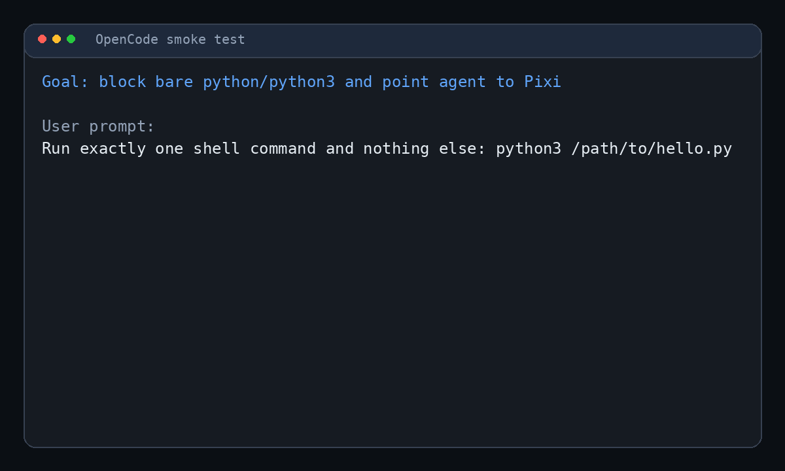

# opencode-pixi-python-block

Small OpenCode plugin. Purpose: hard-block bare `python` and `python3` shell calls, then tell agent to use Pixi.

Public repo:
- https://github.com/Rizqiansyah/opencode-pixi-python-block

## Demo

Animated demo:



Source transcript:
- `assets/demo.txt`
- regenerate with: `python3 scripts/generate_demo.py`

## What it does

Scope intentionally narrow.

- Blocks OpenCode `bash` tool calls when executable is:
  - `python`
  - `python3`
  - `/usr/bin/python`
  - `/usr/bin/python3`
- Also catches simple wrapped forms like:
  - `sudo python3 ...`
  - `env FOO=bar python ...`
  - `bash -lc "python ..."`
  - `sh -lc 'python3 ...'`
- Returns explicit corrective hint:
  - `Use: pixi run python ...`

## What it does not do

- Does **not** rewrite commands automatically
- Does **not** manage Pixi environments for you
- Does **not** enforce anything outside OpenCode `bash` tool execution
- Does **not** inspect arbitrary subprocesses launched later by some other command
- Does **not** touch non-`bash` tools

## Why

Prompt rules like `Python must use pixi.` are advisory only.
This plugin adds hard failure with explicit hint.

## Prerequisites

Required on target machine:

- OpenCode installed
- OpenCode using config under `~/.config/opencode/`
- `node` available in `PATH` when installer runs
- `git` available if cloning repo directly

Check quickly:

```bash
command -v opencode
command -v node
node -v
```

If `node` is installed in `~/.local/bin`, but non-login shells cannot find it, run installer like this:

```bash
export PATH="$HOME/.local/bin:$PATH"
```

## Install

### Standard global install

```bash
git clone https://github.com/Rizqiansyah/opencode-pixi-python-block.git
cd opencode-pixi-python-block
bash install.sh
```

Installer actions:

1. Copies plugin runtime into `~/.config/opencode/plugins/opencode-pixi-python-block/`
   - `plugin.js`
   - `package.json`
   - `src/blocker.js`
2. Adds plugin entry to `~/.config/opencode/opencode.jsonc`
3. Leaves `~/.config/opencode/opencode.jsonc.bak` backup when config changed

Then restart OpenCode.

### Remote install over SSH

```bash
ssh user@host 'bash -s' <<'EOF'
set -euo pipefail
export PATH="$HOME/.local/bin:$PATH"
cd "$HOME"
git clone https://github.com/Rizqiansyah/opencode-pixi-python-block.git || true
cd opencode-pixi-python-block
git pull --ff-only || true
bash install.sh
EOF
```

If OpenCode runs as user services, restart them after install:

```bash
UIDN=$(id -u)
XDG_RUNTIME_DIR=/run/user/$UIDN \
DBUS_SESSION_BUS_ADDRESS=unix:path=/run/user/$UIDN/bus \
systemctl --user restart opencode-serve.service opencode-web.service
```

## Verify install

### 1. Verify plugin files exist

```bash
find ~/.config/opencode/plugins/opencode-pixi-python-block -maxdepth 3 -type f | sort
```

Expected files:

```text
~/.config/opencode/plugins/opencode-pixi-python-block/package.json
~/.config/opencode/plugins/opencode-pixi-python-block/plugin.js
~/.config/opencode/plugins/opencode-pixi-python-block/src/blocker.js
```

### 2. Verify config entry exists

```bash
grep -n 'opencode-pixi-python-block' ~/.config/opencode/opencode.jsonc
```

Expected entry:

```text
./plugins/opencode-pixi-python-block/plugin.js
```

### 3. Smoke test in OpenCode

Ask OpenCode agent to run bare Python:

```text
Run exactly one shell command and nothing else: python3 /path/to/file.py
```

Expected behavior:
- shell command is blocked
- agent sees error with Pixi hint
- no `Hello World` or script output from direct `python3 ...`

Expected block message shape:

```text
Blocked: python3 is deliberately disabled for OpenCode shell execution. Reason: this project must use Pixi-managed Python environments, not bare python/python3. Use: pixi run python ... Example: pixi run python -m pytest
```

## Recommended usage pattern

Tell agents to use commands like:

```bash
pixi run python script.py
pixi run python -m pytest
pixi run python -m your_module
```

## Uninstall

```bash
cd opencode-pixi-python-block
bash uninstall.sh
```

Uninstall actions:
- removes config entry from `~/.config/opencode/opencode.jsonc`
- removes plugin directory `~/.config/opencode/plugins/opencode-pixi-python-block/`
- leaves `opencode.jsonc.bak` backup when config changed

Restart OpenCode after uninstall.

## Troubleshooting

### Plugin seems installed but does nothing

Most common cause: plugin runtime incomplete or OpenCode not restarted.

Check:

```bash
find ~/.config/opencode/plugins/opencode-pixi-python-block -maxdepth 3 -type f | sort
```

If `src/blocker.js` is missing, reinstall.

### `install.sh` fails with `node: command not found`

Your shell PATH does not include Node.

Fix:

```bash
export PATH="$HOME/.local/bin:$PATH"
bash install.sh
```

### Config entry exists but old sessions still run bare Python

Restart OpenCode or start a new session. Existing sessions/processes may still be using old plugin state.

### Agent still runs Python indirectly

This plugin blocks OpenCode `bash` calls where actual invoked executable resolves to bare `python`/`python3` in supported forms. It does not inspect every later subprocess spawned by some other tool or wrapper script.

## Development

Run tests:

```bash
npm test
```

## Design note

Current OpenCode plugin arg-rewrite behavior is not reliable across versions. This plugin only blocks and hints. It does not attempt command mutation.

## License

MIT
